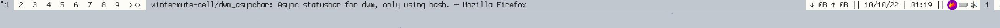

# dwm_asyncbar

An `xsetroot` based statusbar for dwm, that uses asyncronous blocks
to save on performance.
Written entirely in bash, designed to be easily understandable and extensible.



## Install
- clone this repo
- cd into the directory: `cd dwm_asyncbar`
- install using: 
```chmod u+x dwm_asyncbar.sh && cp dwm_asyncbar.sh /usr/bin/```
- add this line to your `.xinitrc` (or whatever else you want to launch the bar from):
```dwm_asyncbar.sh &```
- done! reboot to start the bar. (or just run `dwm_asyncbar.sh` in a terminal to test it.)

## Making changes, adding modules
To add a custom module to `dwm_asyncbar`, modify `dwm_asyncbar.sh` in the
following way:
- Add a function that returns your desired string under the `# MODULE FUNCTIONS`
header. The returned string should end in ` $SEP` as each module delivers its own
terminating separator characters. You can of course Substitute you own seperating
character.

Example:

```
helloworld(){
    echo -e "hello world! $SEP"
}
```

- Add a call to your function in the loop of choice under the `#getter loops` 
header.
Each of the loops listed there runs in a specified interval, so pick the correct
one for your module.

Example notice the added `$(helloworld)`:

```
while true; do # one second loop
    echo $(nettraf) $(helloworld) > /tmp/dwmbar_shortpipe
    sleep 1s
done &
```

- Done! Restart the bar to see the effect.
